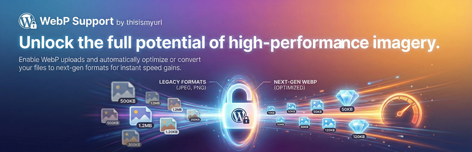

# WebP Support by thisismyurl

🔗 **[Plugin Homepage](https://thisismyurl.com/webp-support-thisismyurl/#register)**

**WebP Support by thisismyurl.com** is a lightweight, professional-grade tool designed to make your WordPress site faster, leaner, and more responsive. 

WebP images are the industry standard for modern web performance, offering significantly smaller file sizes than JPEG or PNG while maintaining crisp visual quality. This plugin ensures your WordPress workflow is fully optimized for these files, giving you better SEO rankings and a faster experience for your mobile users.

### The Power of Choice
Unlike standard WebP plugins, this tool is "ecosystem aware." If you are also using our **AVIF Support** plugin, you can choose to automatically convert WebP uploads into the even more advanced AVIF format, ensuring your site always uses the absolute best compression technology available.

### Key Benefits & Features:
* **Enable WebP Uploads:** Safely bypass WordPress restrictions to manage `.webp` files directly in your Media Library.
* **Automated Optimization:** Fine-tune the quality and compression of your WebP files as they are uploaded.
* **Cross-Codec Upgrading:** Seamlessly convert WebP uploads to AVIF if the sibling plugin is detected.
* **Precision Controls:** Use our intuitive quality sliders under **Tools > WebP Support** to find the perfect balance between file size and clarity.
* **Lightweight & Reliable:** Built on our shared TIMU Core library to ensure maximum stability and zero site bloat.

## ⚙️ Installation
1. Upload the `webp-support-thisismyurl` folder to the `/wp-content/plugins/` directory.
2. Activate the plugin through the 'Plugins' menu in WordPress.
3. Navigate to **Tools > WebP Support** to configure your optimization settings.

## ❓ FAQ
= Is this plugin free? =
Yes! The WebP Support plugin is 100% free to download and use. Our goal is to help everyone achieve a faster, modern web.

= Why should I register for support? =
While the core features are free, registering your copy allows you to access priority technical support and receive automatic updates directly in your dashboard. It�s the best way to ensure your site stays compatible with future WordPress updates.

= How do I register? =
Visit [https://thisismyurl.com/webp-support-thisismyurl/#register](https://thisismyurl.com/webp-support-thisismyurl/#register) to sign up. Once you have your key, enter it into the "License Key" field in the plugin settings to unlock support access.

= Does this delete my original images? =
No. The plugin optimizes the files you upload to ensure they are web-ready without destroying your original source content.

## 🗺️ Roadmap & Activity

---
© 2026 [thisismyurl](https://thisismyurl.com)